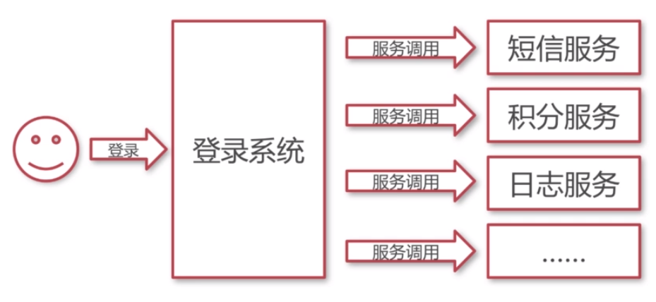
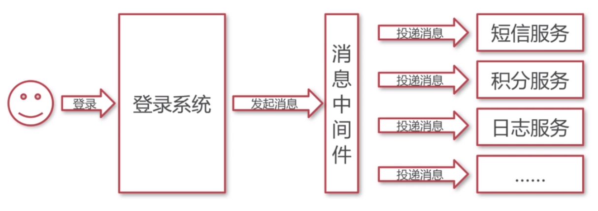

# 为什么使用消息中间件

### 不使用消息中间件

- 通过服务调用让其他系统感知事件发生。
- 登陆时需要同步执行各种服务，需要等待时间长，客户觉得网站反应慢。

### 通过消息中间件解耦服务调用

- 登陆系统只需要发起消息到消息中间件即可，无须等待各种服务的执行完毕。

### 消息中间件的优点

- 解耦
- 异步
- 横向扩展
  - 可通过添加服务器来处理消息。
- 安全可靠
  - 消息会保存在消息中间件，直到被消费。
- 顺序保证