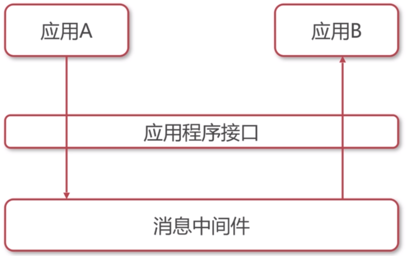

# 消息中间件概述

### 什么是中间件

- 非底层操作系统软件，非业务应用软件，不是直接给最终用户使用，不能直接给客户带来价值的软件统称为中间件。

### 什么是消息中间件

- 关注于**数据的发送和接受** ，利用高效可靠的**异步**消息传递机制集成**分布式**系统。

### 消息中间件图示

- 应用程序A通过应用程序接口向消息中间件发送消息。
- 应用程序B通过应用程序接口向消息中间件接受消息。

### 什么是JMS？

- Java消息服务（Java Message Service）即JMS，是一个Java平台关于面向消息中间件的**API**，用于在两个应用程序之间，或分布式系统中发送消息，进行**异步**通信。
- 是一个API规范。

### 什么是AMQP？

- AMQP（advanced message queuing protocol）是一个提供统一消息服务的**应用层**标准协议，基于此协议的客户端与消息中间件可传递消息，**并不受客户端/中间件不同产品，不同开发语言等条件的限制。**

### JMS和AMQP对比

|          | JMS规范                                                      | AMQP协议                                                     |
| -------- | ------------------------------------------------------------ | ------------------------------------------------------------ |
| 定义     | Java api                                                     | Wire-protocol                                                |
| 跨语言   | 否                                                           | 是                                                           |
| 消息类型 | 提供两种消息模型： p2p，pub/sub                         | 提供了五种消息模型： direct，fanout，topic，headers，system |
| 消息类型 | TextMessage，MapMessage，BytesMessage，StreamMessage，ObjectMessage，Message | byte[]                                                       |
| 综合评价 | JMS定义了JAVA API层面的标准；在Java体系中，多个client均可以通过JMS进行交互，不需要应用修改代码，但是其对跨平台的支持较差 | AMQP的主要特征是面向消息、队列、路由（包括点对点和发布/订阅）、可靠性、安全 |

### 常见消息中间件对比

##### ActiveMQ

- ActiveMQ是Apache出品，最流行的，能力强劲的开源消息总线。ActiveMQ是一个完全支持JMS 1.1和J2EE 1.4规范的JMS Provider实现，尽管JMS规范出台已经是很久的事情了，但是JMS在当今的J2EE应用中间仍然扮演着特殊的地位。
- 特性：
  - 多种语言和协议编写客户端。
    - 语言：Java，C，C++，C#，Ruby，Perl，Python，PHP。
    - 应用协议：OpenWire，Stomp REST，WS Notification，XMPP，AMQP。
  - 完全支持JMS 1.1和J2EE 1.4规范（持久化，XA消息，事务）。
  - 虚拟主题、组合目的、镜像队列。

##### RabbitMQ

- 是一个开源的AMQP实现，服务器端用Erlang语言编写。用于在分布式系统中存储转发消息，在易用性、扩展性、高可用性等方面表现不俗。
- 特性：
  - 支持多种客户端，如Python、Ruby、.NET、Java、JMS、C、PHP、ActionScript等。
  - AMQP的完整实现（vhost、Exchange、Binding、Routing Key等）。
  - 事务支持/发布确认。
  - 消息持久化。

##### Kafka

- Kafka是一种高吞吐量的分布式发布订阅消息系统，是一个分布式的、分区的、可靠的分布式日志存储服务。它通过一种独一无二的设计提供了一个消息系统的功能。
- 特性：
  - 通过O(1)的磁盘数据结构提供消息的持久化，这种结构对于即使数以TB的消息存储也能够保持长时间的稳定性能。
  - 高吞吐量：即使是非常普通的硬件Kafka也可以支持每秒数百万的消息。
  - Partition、Consumer Group。

##### 综合评价

|          | ActiveMQ                                                     | RabbitMQ                                                     | Kafka                                                        |
| -------- | ------------------------------------------------------------ | ------------------------------------------------------------ | ------------------------------------------------------------ |
| 跨语言   | 支持（Java优先）                                             | 语言无关                                                     | 支持（Java优先）                                             |
| 支持协议 | OpenWire，Stomp，XMPP，AMQP                                  | AMQP                                                         |                                                              |
| 优点     | 遵循JMS规范 安装部署方便                                | 继承Erlang天生的并发性最初用于金融行业，稳定性，安全性有保障 | 依赖zk，可动态扩展结点 高性能、高吞吐量、无限扩容 消息可指定追溯 |
| 缺点     | 根据其它用户反馈，会莫名丢失消息。目前重心在下代产品apolle上，目前社区不活跃，对5.x维护较少 | Erlang语言难度较大 不支持动态扩展                       | 严格的顺序机制，不支持消息优先级 不支持标准的消息协议，不利于平台迁移 |
| 综合评价 | 适合中小企业级消息应用场景，不适合上千个队列的应用场景       | 适合对稳定性要求高的企业级应用                               | 一般应用在大数据日志处理或对实时性（少量延迟），可靠性（少量丢数据）要求稍低的场景使用 |

