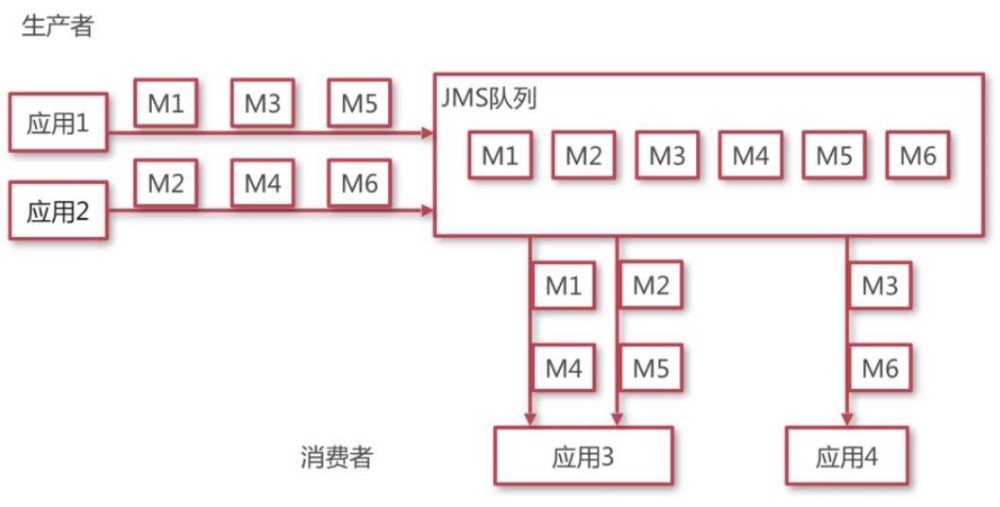
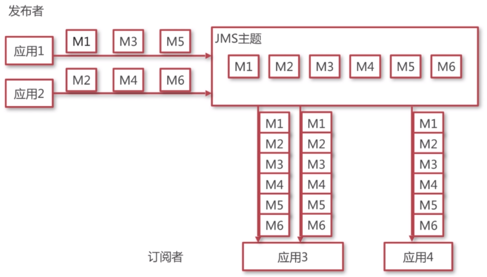
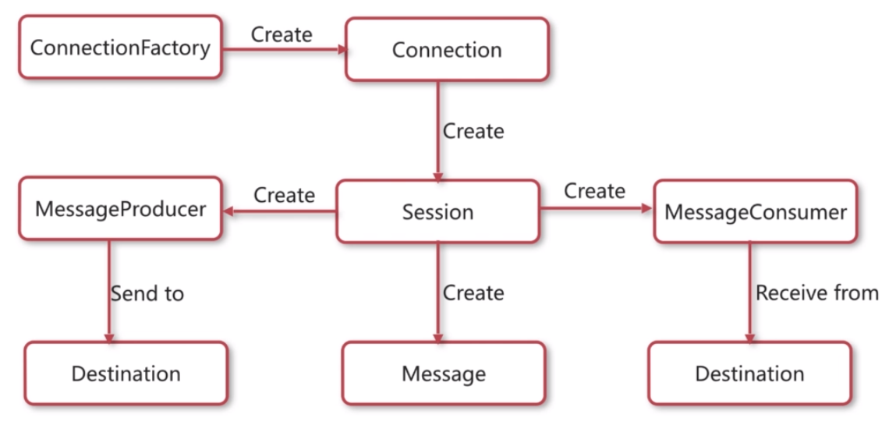

# JMS规范

### Java消息服务定义

- Java消息服务（Java Message Service）即JMS，是一个Java平台关于面向消息中间件的**API**，用于在两个应用程序之间，或分布式系统中发送消息，进行**异步**通信。

### JMS相关概念

- **提供者**：实现JMS规范的消息中间件服务器。
- **客户端**：发送或接收消息的应用程序。
- **生产者/发布者**：创建并发送消息的客户端。
- **消费者/订阅者**：接收并处理消息的客户端。
- **消息**：应用程序之间传递的数据内容。
- **消息模式**：在客户端之间传递消息的方式，JMS中定义了主题和队列两种模式。

### JMS消息模式

##### 队列模型

- 客户端包括生产者和消费者。
- 队列中的消息只能被一个消息者消费。
- 消费者可以随时消费队列中的消息。

###### 队列模型示意图

##### 主题模型

- 客户端包括发布者和订阅者。
- 主题中的消息被所有订阅者消费。
- **消费者不能消费订阅之前就发送到主题中的消息** 。

###### 主题模型示意图

### JMS规范

##### JMS编码接口

- ConnectionFactory：用于创建连接到消息中间件的连接工厂。
- Connection：代表了应用程序和消息服务器之间的通信链路。
- Destination：指消息发布和接收的地点，包括队列或主题。
- Session：表示一个单线程的上下文，用于发送和接收消息。
- MessageConsumer：由会话创建，用于接收发送到目标的消息。
- MessageProducer：由会话创建，用于发送消息到目标。
- Message：是在消费者和生产者之间传送的对象，消息头，一组消息属性，一个消息体。

##### JMS编码接口之间的关系

