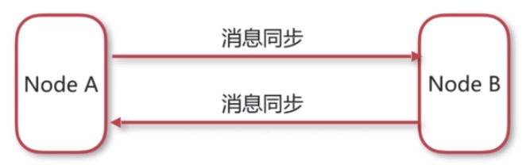
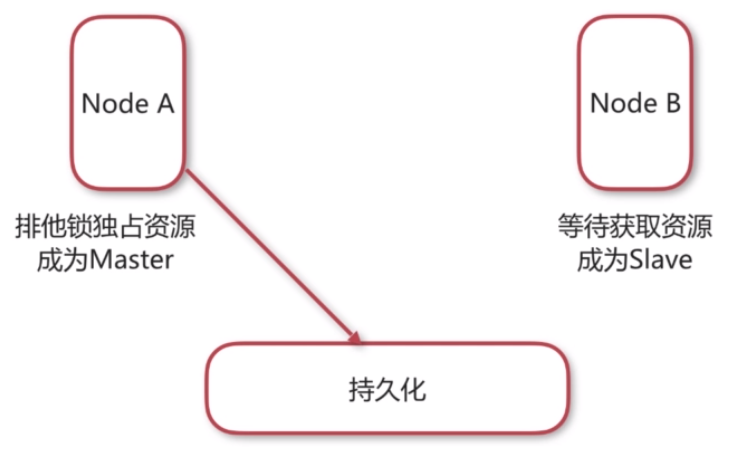
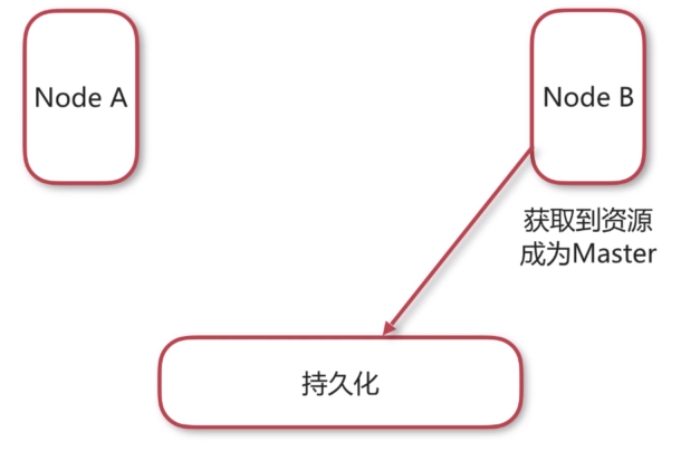
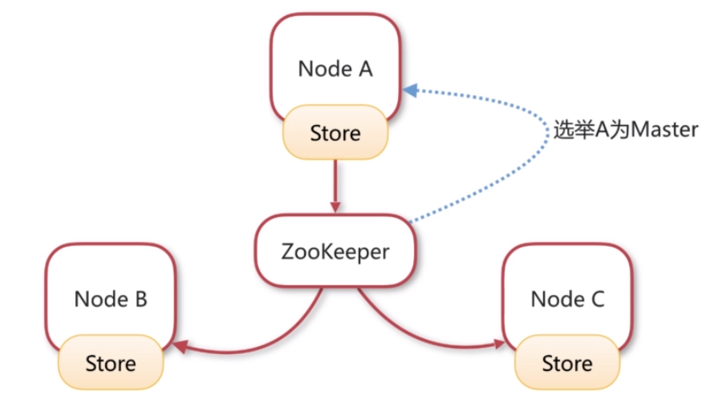
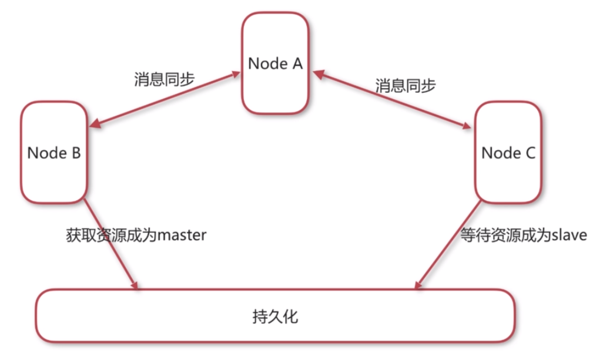

# activemq集群

## ActiveMQ集群配置

### 为什么要对消息中间件集群？

- 实现**高可用**，以排除单点故障引起的服务中断。
- 实现**负载均衡**，以提升效率为更多客户提供服务。

### Active集群基础知识

##### 集群方式

- 客户端集群：让多个消费者消费同一队列。
- Broker clusters：多个Broker之间同步消息。
- Master Slave：实现高可用。

### 客户端配置

###### ActiveMQ失效转移（failover）

- 允许当其中一台消息服务器宕机时，客户端在传输层上重新连接到其它消息服务器。
  - 语法：`failover:(uri1, …， uriN)?transportOptions` 。

###### transportOptions参数说明

- randomize默认为true，表示在URI列表中选择URI连接时是否采用随机策略。
- initialReconnectDelay默认为10，单位毫秒，表示第一次尝试重连之间等待的时间。
- maxReconnectDelay默认30000，单位毫秒，最长重连的时间间隔。

### Broker Cluster集群配置

##### 原理




##### NetworkConnector（网络连接器）

- 网络连接器主要用于配置ActiveMQ服务器与服务器之间的网络通讯方式，用于服务器透传消息。
- 网络连接器分为静态连接器和动态连接器。

##### 静态连接器

```xml
<networkConnectors>
	<networkConnector uri="static:(tcp://127.0.0.1:61617,tcp://127.0.0.1:61618)"/>
</networkConnectors>
```

##### 动态连接器

```xml
<networkConnectors>
	<networkConnector uri="multicast://deafult"/>
</networkConnectors>

<transportConnectors>
	<transportConnector uri:"tcp://localhost:0" discoveryUri="multicast://default"/>
</transportConnectors>
```

---

## Master/Slave集群配置

### ActiveMQ Master Slave 集群方案

- Share nothing storage master/slave（已过时，5.8+后移除）。
- Shared storage master/slave 共享存储。
- Replicated LevelDB Store 基于复制的LevelB Store。

### 共享存储集群原理

- Node A获得排他锁：



- 当Node A宕机时,Node B获得排它锁时：



### 基于复制的LevelDB Store的原理



### 两种集群方式对比

|                | 高可用 | 负载均衡 |
| -------------- | ------ | -------- |
| Master/Slave   | 是     | 否       |
| Broker Cluster | 否     | 是       |

### 三台服务器的完美集群方案



---

## ActiveMQ集群配置方案

|        | 服务器端口 | 管理端口 | 存储               | 网络连接器     | 用途           |
| ------ | ---------- | -------- | ------------------ | -------------- | -------------- |
| Node-A | 61616      | 8161     | -                  | Node-B、Node-C | 消费者         |
| Node-B | 61617      | 8162     | /share_file/kahadb | Node-A         | 生产者，消费者 |
| Node-C | 61618      | 8163     | /share_file/kahadb | Noed-A         | 生产者，消费者 |

