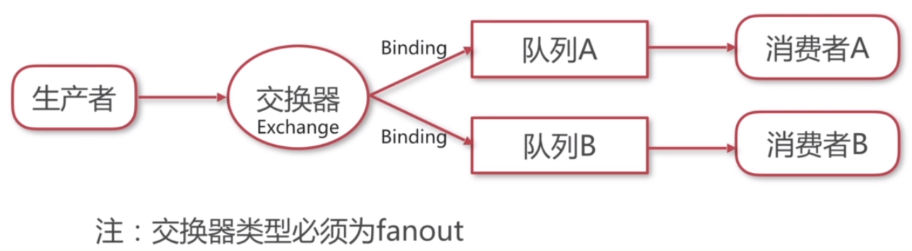

# 使用其他消息中间件

### 企业开发需要解决的问题

- 不同业务系统分别处理同一消息，同一业务系统负载处理同类消息。
- 解决消息发送时的一致性问题。
- 解决消息处理时的幂等性问题。
- 基于消息机制建立事务总线。

### 分析需要做的事

- 解决各业务系统集群处理同一条消息。
- 实现自己的消息提供者。

### 常用消息中间件

- ActiveMQ
- RabbitMQ
- Kafka

##### RabbitMQ

- 使用交换器绑定到队列。

###### RabbitMQ消息提供者过程

- 创建ConnectionFactory。
- 创建Connection。
- 创建Channel。
- 定义Exchange。
- 定义Queue并且绑定队列。

##### Kafka使用group.id分组消费者

- 配置消息者参数group.id相同时对消息进行负载处理。
- 配置服务器partitions参数，控制同一个group.id下的consumer数量小于partitions。
- Kafka只保证同一个partitions下的消息是有序的。

###### Kafka消息提供者过程

- 创建生产者。
- 创建消费者。